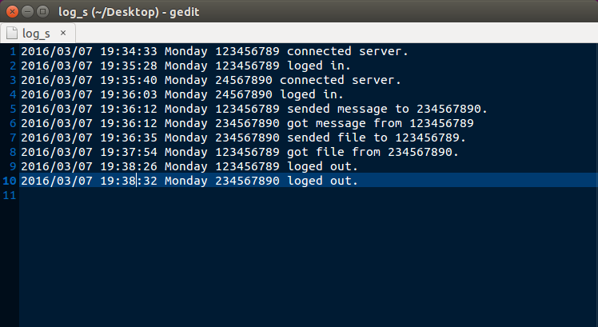
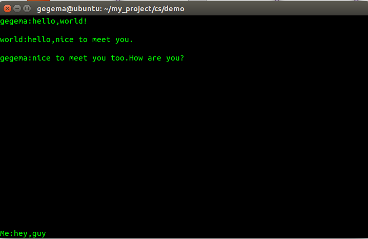

##即时通讯项目阶段性小结
基本是现实了，信息发送，文件传输，记录服务器日志。

但是因为刚开始做的时候并没有参考其它项目。纯粹自己设计，希望带着思考去完成这个项目。当完成之后，给前辈过目。结果是被吐槽设计过于复杂，而且有天然的缺陷。 就是如此设计，访问量稍微大一点的时候，服务器会过载。

在有过自己的思考之后，我决定对整个方案进行优化，客户端改成通过“心跳”的连接方式定时连接服务器，以减少服务器同一时间的连接数量。同时也能是程序的逻辑简单化，便于维护。

